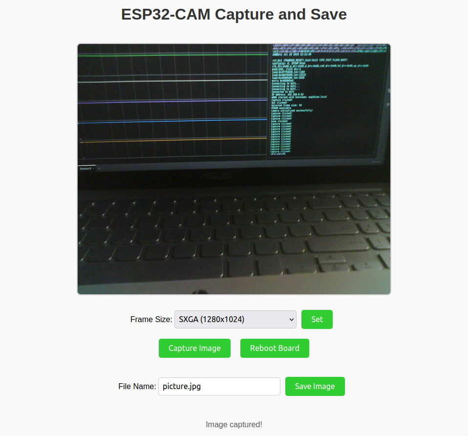

# ESP32-CAM Capture and Save

This project demonstrates how to use the ESP32-CAM to capture images and save them to an SD card or in the browser. The web interface allows users to select the image frame size, capture images, and save them with a custom file name.

## Features

- Web interface for capturing and saving images.
- Selectable image frame sizes.
- Save images with custom file names and a checkbox to select where to save the image (sdcard/browser)
- Onboard LED control for status indication.
- implemented the mDNS to avoid typing the IP address in the browser.

## Hardware Requirements

- [ESP32-CAM](https://www.espressif.com/en/products/hardware/esp32-cam/overview)
- MicroSD card (formatted as FAT32)
- Better if you power the esp32cam from USB power bank.

## User Interface

The above screenshot represents the current design and functionality of the WebUI. This is for your reference.

## How to start with this project?

Follow these easy steps to start working with this project:
- Clone the repo / fork and then clone
- Open the project in Platformio.
- create a hotspot with SSID: esp32cam_wifi and pass: esp32cam
- build, flash, open the serial monitor to see the user guiding logs.
- Onboard led flash will blink 3 times to indicate that the board is ready.
- connect your PC/laptop to the same network and in your browser type http://esp32cam.local
- this will open up the UI interface to play with.
- Always set the resolution of the image that you want to capture and save.
- Reboot button is there just in case you want to change the resolution of the image.

# Potential Applications and Target Audience for ESP32-CAM Project

## Applications
This project opens up numerous practical applications, including:

### 1. **Surveillance Systems**
   - **Use Case**: Implement low-cost security cameras for homes, offices, or industrial areas.
   - **Features**: Real-time image capture, adjustable resolution, and local storage on an SD card.
   - **Benefit**: Compact and affordable solution for DIY security setups.

### 2. **Home Automation**
   - **Use Case**: Integrate with smart home systems to monitor entrances, garages, or specific rooms.
   - **Features**: Remote monitoring through the web interface.
   - **Benefit**: Provides customizable and accessible automation features.

### 3. **Wildlife and Nature Monitoring**
   - **Use Case**: Capture images of wildlife or monitor remote outdoor areas.
   - **Features**: Battery-powered operation with SD card storage for remote use.
   - **Benefit**: Portable and discreet, ideal for outdoor photography or research.

### 4. **IoT in Agriculture**
   - **Use Case**: Monitor crops, livestock, or farm equipment using image data.
   - **Features**: Adjustable resolution to suit various agricultural needs.
   - **Benefit**: Cost-effective and scalable solution for smart farming.

### 5. **Educational Tools**
   - **Use Case**: Teach students and beginners about IoT, camera modules, and web-based controls.
   - **Features**: Hands-on experience with hardware and software integration.
   - **Benefit**: Perfect for classrooms, workshops, and maker communities.

### 6. **Hobbyist Projects**
   - **Use Case**: Develop creative DIY projects, such as bird feeder cameras or time-lapse photography setups.
   - **Features**: Easy-to-use web interface with customizable options.
   - **Benefit**: Encourages creativity and exploration among enthusiasts.

### 7. **Industrial Remote Monitoring**
   - **Use Case**: Inspect machinery, pipelines, or other hard-to-access areas.
   - **Features**: Remote image capture with local storage for documentation.
   - **Benefit**: Reduces the need for manual inspection in challenging environments.

### 8. **Prototype Development**
   - **Use Case**: Use as a base for prototyping camera-based IoT solutions.
   - **Features**: Simple configuration, adjustable frame size, and storage options.
   - **Benefit**: Cost-effective platform for startups and researchers.

---

## Target Audience
This project caters to a wide range of individuals and groups:

### 1. **DIY Enthusiasts and Makers**
   - Hobbyists looking to build creative, camera-based projects.

### 2. **Educators and Students**
   - Schools, universities, and makerspaces teaching IoT, programming, and hardware integration.

### 3. **IoT Developers**
   - Developers prototyping or experimenting with camera-based IoT solutions.

### 4. **Home Automation Enthusiasts**
   - Individuals integrating smart devices into their homes for monitoring or security purposes.

### 5. **Agricultural Technologists**
   - Farmers and researchers exploring smart farming techniques using image data.

### 6. **Wildlife Researchers**
   - Professionals and enthusiasts monitoring wildlife or conducting ecological studies.

### 7. **Startups and Small Businesses**
   - Entrepreneurs developing cost-effective surveillance or monitoring solutions.

### 8. **Industrial Engineers**
   - Professionals leveraging remote monitoring for machinery and infrastructure.

